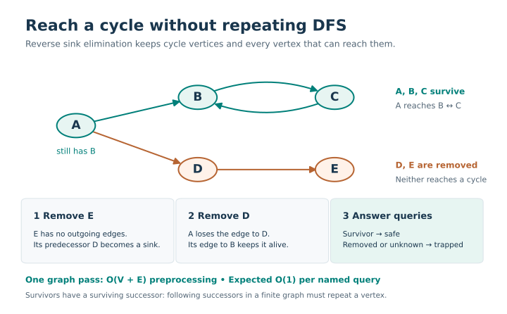
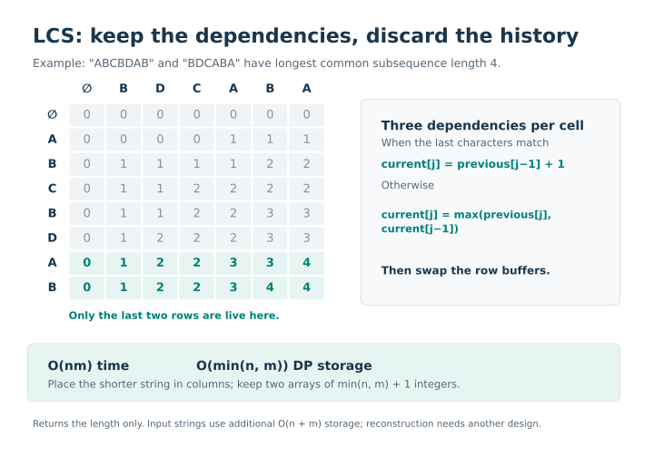
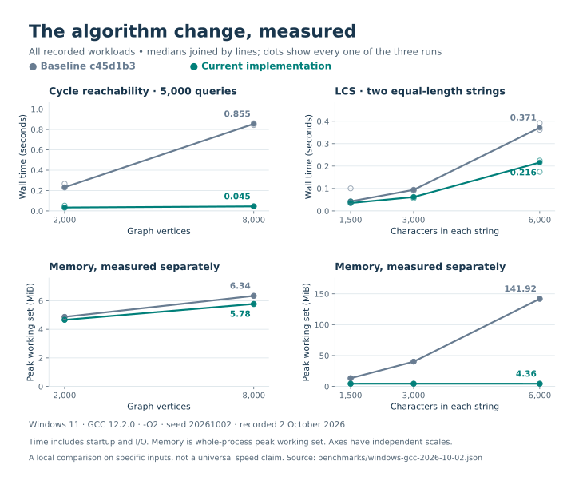

# Selected Competitive Programming Solutions

[](https://github.com/IGoByLotsOfNames/competitive-programming-selected/actions/workflows/cpp.yml)

Six self-contained C++20 programs from my competitive-programming practice, with documented contracts, independent correctness checks and measured algorithm improvements. My competition background includes a Bronze Medal at the 2023 National Olympiad in Informatics.

The maintained implementations were rewritten from my 2023 practice files. The tests and engineering notes describe this repository's current behaviour; they do not redistribute original contest statements or claim judge acceptance that has not been verified.

## Start here

Two implementations show how a small change in the algorithm can remove a much larger cost:

| Case study | Design decision | Evidence to inspect |
|---|---|---|
| [Cycle reachability](#cycle-reachability-one-graph-pass) | Replace recursive search per query with iterative reverse sink elimination | A correctness invariant, a 100,000-node stress case and a comparison against the earlier implementation |
| [Longest common subsequence](#lcs-two-rows-are-enough) | Store only the DP rows needed for the next transition | An exhaustive small-input oracle, an asymmetric stress case and measured process memory |

The other four programs cover breadth: grid search, components, weighted paths and minimum-cost character transformations. Each solution is a standalone executable with a small, explicit input contract.

## Algorithms

| Program | Technique | Time | Auxiliary space |
|---|---|---|---|
| [Knight shortest path](solutions/knight_shortest_path.cpp) | BFS on a blocked grid | O(n²) | O(n²) |
| [Connected components](solutions/connected_components.cpp) | Repeated BFS | O(V+E) | O(V+E) |
| [Longest common subsequence](solutions/longest_common_subsequence.cpp) | Rolling-row dynamic programming | O(nm) | O(min(n,m)) DP storage |
| [Directed cycle reachability](solutions/directed_cycle_reachability.cpp) | Iterative reverse sink elimination | O(V+E+Q), expected name lookup | O(V+E) |
| [Letter transformation palindrome](solutions/letter_transform_palindrome.cpp) | Floyd–Warshall and mirrored-pair optimisation | O(26³+26n) | O(26²) |
| [Directed round trip](solutions/dijkstra_round_trip.cpp) | Two Dijkstra runs with a lazy heap | O((V+E) log(V+E)) | O(V+E) |

Input storage is additional where relevant. [Contracts and reasoning](docs/contracts.md) specify indexing, valid inputs, invariants, numeric bounds and each test oracle.

## Cycle reachability: one graph pass

**Question:** can a queried vertex reach any directed cycle? A vertex need not belong to the cycle itself. The program prints `safe` when such a path exists, and `trapped` otherwise.



*A can reach both a dead end and a cycle. It must survive: the answer depends on whether a cycle-reaching path exists.*

The earlier implementation started recursive DFS for every query. The current implementation stores incoming edges and outgoing-degree counts, removes sinks with a queue, and answers queries from the surviving vertices. Each edge is processed once during elimination. The method avoids repeated graph traversal and recursion-depth dependence.

The invariant gives the reason it works: a removed vertex can only lead to terminating paths. Every survivor has a surviving successor; following successors in a finite graph must revisit a vertex. Preprocessing takes **O(V+E)**, followed by expected **O(1)** per named query, assuming constant-time hashing and bounded token lengths.

[Read the implementation](solutions/directed_cycle_reachability.cpp) · [Detailed reasoning and edge cases](docs/case-studies.md#cycle-reachability)

## LCS: two rows are enough

**Question:** what is the length of the longest subsequence shared by two strings? Characters can be skipped, but their order must stay the same.



*The full table explains the recurrence; the implementation stores only two rows. In the illustrated example, the returned length is 4.*

Each DP cell needs the previous row and its current-row left neighbour. Keeping two row buffers and placing the shorter input in columns reduces DP storage from **O(nm)** to **O(min(n,m))**, while retaining O(nm) time. The program returns the length only. Reconstructing an actual subsequence would require another design.

[Read the implementation](solutions/longest_common_subsequence.cpp) · [Memory accounting and tradeoffs](docs/case-studies.md#longest-common-subsequence)

## Measured comparison

Recorded on Windows with GCC 12.2.0, `-O2`, three repetitions, against maintained baseline commit `c45d1b3`. Both versions produced identical outputs for every benchmark input.



*Time and memory are plotted separately. Every raw run is included; each panel has its own vertical scale. The table below selects the largest recorded input for each algorithm.*

| Workload | Baseline median | Current median | Baseline/current median peak process memory |
|---|---:|---:|---:|
| 8,000-vertex chain ending in a self-loop; 5,000 queries | 0.855 s | 0.045 s | 6.34 / 5.78 MiB |
| Two 6,000-character strings | 0.371 s | 0.216 s | 141.92 / 4.36 MiB |

These are local observations, not universal speed claims. Wall time includes process startup and input/output; memory is Windows peak working set, including runtime overhead. See [raw samples and environment](benchmarks/windows-gcc-2026-10-02.json) and [reproduction instructions](benchmarks/README.md). Complexity and correctness matter more than small timing differences.

## How correctness is checked

The [test harness](tests/check_solutions.py) checks each executable through its real input/output interface. Independent oracles deliberately use different approaches from the maintained algorithms.

| Layer | What it checks |
|---|---|
| Fixed regressions | Blocked knight endpoints, duplicate graph edges, unknown queries, unreachable paths and a four-billion-cost transformation result |
| Seeded differential cases | 80 generated cases per algorithm by default: 480 small cases in total, with swapped-argument checks for LCS |
| Independent oracles | Union-find, exhaustive subsequences, transitive closure, all-pairs shortest paths, explicit graph relaxation and repeated Dijkstra |
| Stress cases | 100,000-node acyclic and cycle-ending chains, plus a 100,000-by-64 LCS input |
| CI | Ordinary builds and AddressSanitizer/UndefinedBehaviorSanitizer builds on Linux |

These checks catch implementation mistakes; the invariants and valid-input contracts explain why each algorithm generalises beyond the generated cases. The repository has eight test suites: fixed regressions, six differential suites and stress tests.

## Build and verify

Requires a C++20 compiler and Python 3.11+ for the test harness. CMake 3.20+ is optional.

```bash
cmake -S . -B build -DCMAKE_BUILD_TYPE=Release
cmake --build build --parallel
ctest --test-dir build --output-on-failure
```

For a single program:

```bash
g++ -std=c++20 -O2 -Wall -Wextra -Wpedantic solutions/directed_cycle_reachability.cpp -o directed_cycle_reachability
printf '3\na b\nb c\nc b\na\nunknown\n' | ./directed_cycle_reachability
# a safe
# unknown trapped
```

The test runner can also use a directory containing all six directly compiled binaries:

```bash
python tests/check_solutions.py --bin-dir build --cases 80 --seed 20261002
```

## Explore the repository

- [Input contracts](docs/contracts.md): indexing, valid inputs, bounds, invariants and test oracles for all six programs.
- [Algorithm case studies](docs/case-studies.md): design choices, worked examples and tradeoffs behind the two highlighted changes.
- [Benchmark reproduction](benchmarks/README.md): workloads, compiler flags, measurement scope and raw samples.
- [Figure sources](docs/visuals/README.md): regenerate the diagrams and benchmark graph from committed data.

## Licence

Implementation code is MIT licensed. Original statements remain their authors' property and are not included.
