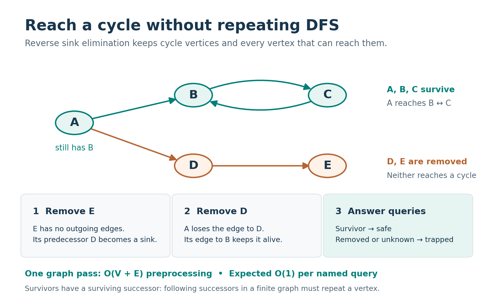
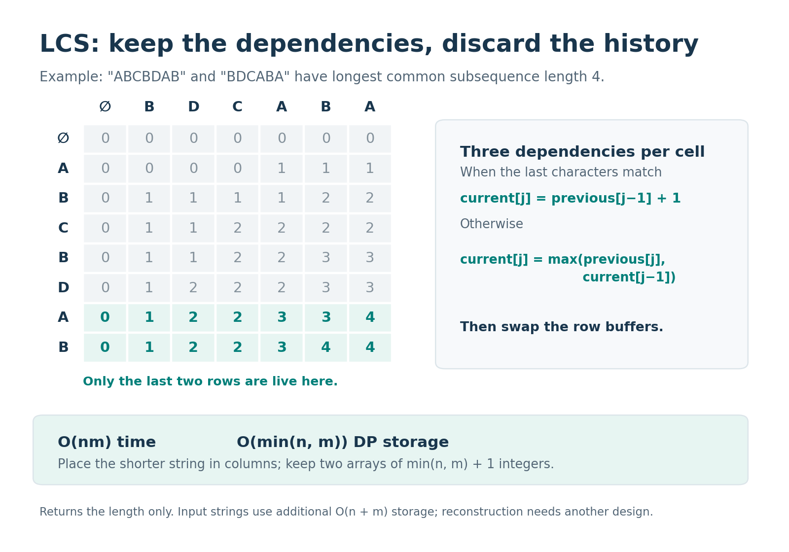
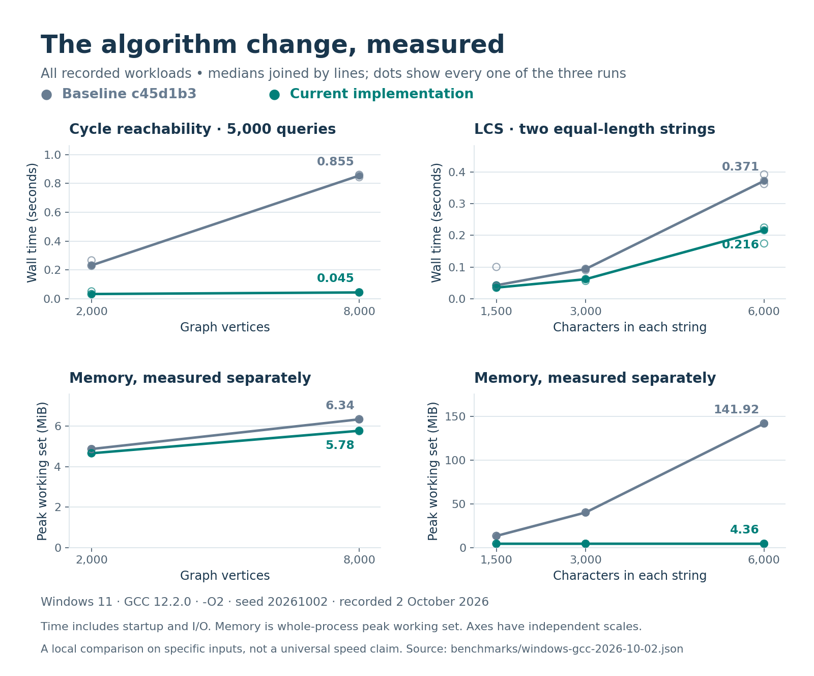

# Two algorithm design decisions

These notes connect the maintained C++ implementations to the invariants, tests and measurements in this repository. The baseline is an earlier maintained revision, `c45d1b3`, rather than the unmodified practice archive.

## Cycle reachability

### The query is about reachability, not membership

The input is a directed graph of names, followed by queries. For each name, the program answers whether **at least one path** reaches a directed cycle. `safe` and `trapped` are output labels for this property. A vertex may lead to both a cycle and a dead end and still be `safe`.



For this example, the input and output can be written as:

```text
Input             Output
5
A B
B C
C B
A D
D E
A                 A safe
D                 D trapped
E                 E trapped
unknown           unknown trapped
```

### Remove what cannot work

The implementation first records each vertex's predecessors and outgoing-degree count. It places every sink, a vertex with zero outgoing degree, into a queue. Removing a sink decrements each predecessor's outgoing degree; a predecessor that becomes a sink joins the queue.

The two halves of the argument are useful:

1. **Every removed vertex cannot reach a cycle.** Initial sinks have no successor. A vertex removed later has only successors already known not to reach cycles. Induction over removal order proves the claim.
2. **Every surviving vertex can reach a cycle.** It has at least one surviving outgoing edge. Following surviving successors forever in a finite graph must repeat a vertex, creating a cycle.

The survivors are therefore exactly the vertices needed for the query. A full strongly connected component decomposition could also solve the problem, but would add component construction and reachability propagation when only this boolean result is needed.

### Costs and boundary cases

Every edge is visited once when building the predecessor lists and at most once during elimination. Preprocessing uses O(V+E) time and space. A query performs a name lookup and degree check, giving expected O(1) query time under the `unordered_map` assumptions in the [contract](contracts.md#directed-cycle-reachability). The approach has no recursion-depth dependence.

Parallel edges must each contribute to, and later decrement, the outgoing degree. A self-loop prevents its vertex from becoming a sink. An unknown name has no graph path and is `trapped`. Removing vertices with zero **incoming** degree would answer a different question.

The independent small-graph oracle uses transitive closure rather than sink elimination. Stress cases include a 100,000-node chain with no cycle and one ending in a cycle. The benchmark uses smaller cycle-ending chains so that the old recursive baseline can complete on the recorded machine; it is not a distribution of arbitrary real-world graphs.

## Longest common subsequence

### Start from the dependency graph

For strings `a` and `b`, let `L(i,j)` be the LCS length of their prefixes of lengths `i` and `j`.

```text
L(i,j) = L(i−1,j−1) + 1                  if a[i−1] == b[j−1]
         max(L(i−1,j), L(i,j−1))         otherwise

L(0,j) = L(i,0) = 0
```

Every transition uses the previous row, plus the current row's left neighbour. Once a row is finished, older rows cannot affect a later transition. The implementation swaps two row buffers after each outer iteration and puts the shorter input in the columns.



For `ABCBDAB` and `BDCABA`, the output is `4`. The illustration includes the full table for explanation, but that full table is never allocated by the maintained program.

### Know exactly what is being saved

The two arrays hold `2 × (min(n,m) + 1)` integers. This is **O(min(n,m)) auxiliary DP space**; the input strings still use O(n+m) storage. The nested loops still evaluate nm cells, so time remains O(nm).

This tradeoff works because the interface returns only a length. Keeping all predecessor decisions to reconstruct a subsequence would require more memory, or an alternative reconstruction algorithm. The program also operates on nonempty whitespace-free byte strings; it does not parse Unicode code points or represent an empty string through the token interface.

Tests use exhaustive subsequence enumeration on small strings and check both argument orders. The 100,000-by-64 stress case exercises the shorter-column choice. Whole-process benchmark memory includes C++ runtime and input overhead, so it should not be read as the exact number of bytes in the DP arrays.

## Reading the measurements



The graph plots support a specific observation: on repeated queries along a chain into a cycle, eliminating repeated traversal helps as the graph grows. The LCS plots show a large reduction in whole-process memory on the recorded square inputs. They do not establish a universal speedup for every graph or string.

All plotted data comes from [the committed JSON](../benchmarks/windows-gcc-2026-10-02.json). Three runs per configuration reveal some variability, but are too few to make strong statistical claims. The host was not isolated from other work; timing includes process startup and input/output, and the plots use different scales for different metrics. The complete [measurement procedure](../benchmarks/README.md) records these limits and explains how to rerun the comparison.

[Back to the repository overview](../README.md)
